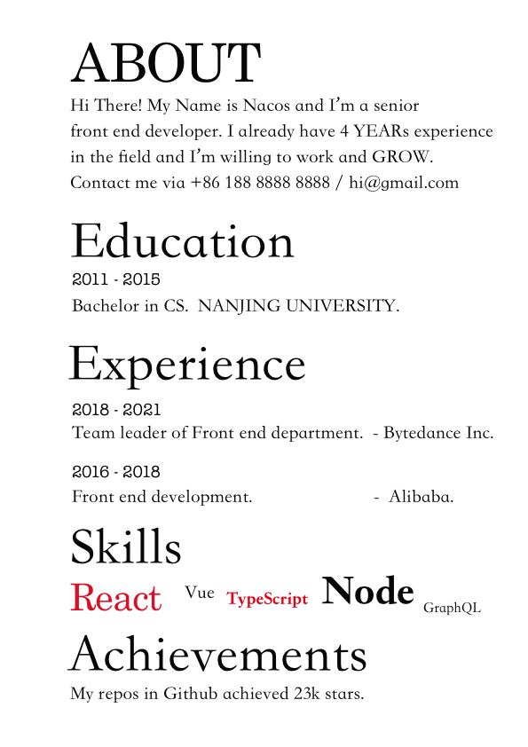
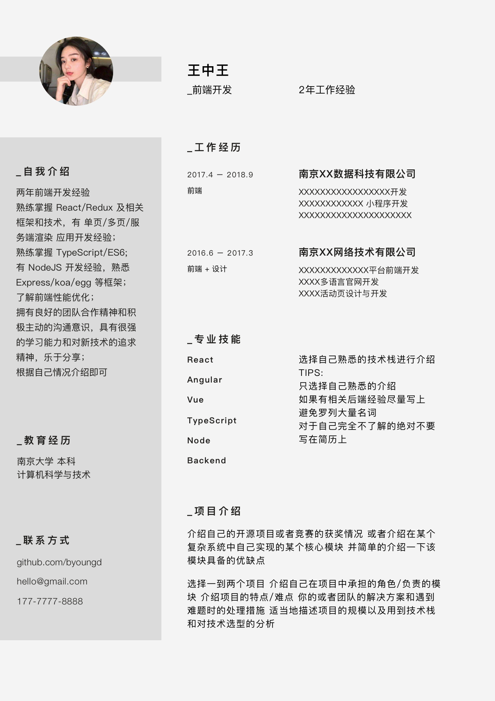

# 适合程序员/设计师的简历模板

制作工具：Sketch（版本:4.7）

## 说明

该简历的示例内容虽然偏向于前端工程师，不过适用范围并不仅限于此。

## 2021 版

## 2019 版

## 前端、设计师：

## 程序员：

## 程序员中文：

## 生成 PDF 步骤

使用 Sketch.app: Share -> Export Artboards To PDF

> 旧版本是 File -> Export Artboards To PDF
